# Microservice Architecture — E-Commerce Platform

A production-grade **microservice e-commerce backend** written in **Go (Golang)**, built around
domain-driven service boundaries. Every business capability — identity, merchant onboarding,
catalog, cart & orders, payments, reviews, storefront experience — lives in a self-contained,
independently deployable service that owns its own data and talks to its peers over **gRPC**,
while side effects travel asynchronously over **Apache Kafka**.

This document is the single source of truth for the platform's topology. It covers the full
service catalog, the internal clean-architecture layout of a service, the **PostgreSQL
cluster-per-bounded-context** persistence tier with its **PgBouncer** poolers, the ClickHouse
OLAP analytics pipeline, the observability stack, and both deployment targets (Docker Compose
and Kubernetes + ArgoCD).

---

## Table of Contents

1. [Key Features](#key-features)
2. [Architecture Overview](#architecture-overview)
3. [Service Catalog](#service-catalog)
4. [Database Layer — PostgreSQL Cluster & PgBouncer](#database-layer--postgresql-cluster--pgbouncer)
5. [Internal Service Architecture](#internal-service-architecture)
6. [Data & Event Flow](#data--event-flow)
7. [OLAP Analytics Layer](#olap-analytics-layer)
8. [Observability Architecture](#observability-architecture)
9. [Deployment Architectures](#deployment-architectures)
10. [Technology Stack](#technology-stack)
11. [Getting Started](#getting-started)
12. [Port Map Registry](#port-map-registry)
13. [Justfile Reference](#justfile-reference)
14. [Project Structure](#project-structure)
15. [Screenshots](#screenshots)

---

## Key Features

| Domain | Capabilities |
|--------|-------------|
| **Auth & Users** | Registration, login, JWT access/refresh token rotation, password reset flows, `GetMe` profile resolver |
| **Roles & RBAC** | Role CRUD, permission matrices, and — as of the `role` / `user_role` split — a dedicated `UserRoleService` for `AssignRoleToUser` / `RemoveRoleFromUser` / `FindByUserId` |
| **Merchants** | Merchant onboarding plus five satellite contexts: details, business data, policies, awards, social links |
| **Catalog & Inventory** | Products and categories with full CRUD, stock tracking, pricing, and soft-delete/trash/restore flows |
| **Cart & Orders** | Add-to-cart, checkout, order lifecycle management, and order-item line decomposition |
| **Transactions** | Payment recording, status tracking, and event-driven confirmation pipelines |
| **Reviews** | Product ratings and detailed review submissions |
| **Storefront Experience** | Banners, sliders, and shipping addresses — the merchandising surface of the storefront |
| **Notifications** | Kafka-driven email service for merchant confirmation, account verification, password resets, and transaction updates |
| **OLAP Analytics** | ClickHouse warehouse fed by `stats_writer` (Kafka consumer + backfill) and served by `stats_reader` (7 gRPC analytics services) |
| **Persistence** | Six isolated PostgreSQL 17 clusters — one per bounded context — each fronted by its own PgBouncer pooler |
| **Observability** | Metrics (Prometheus + Grafana), logs (Loki + Promtail), traces (Jaeger + OpenTelemetry), plus Postgres/Kafka/Node exporters |
| **Resilience** | Circuit breaker, rate limiter, load monitor, and a `DependencyGuard` (per-call timeout + breaker + bulkhead) wrapping every outbound gRPC adapter call |
| **Deployment** | Docker Compose for local dev, Kubernetes manifests with HPA for production, ArgoCD for GitOps delivery |

---

## Architecture Overview

The platform is a **distributed microservice architecture**. Each service is a standalone Go
binary with clean-architecture internals, its own protobuf contract, and exclusive ownership of
one bounded context's database. An **API Gateway** (Echo + NGINX) is the single public edge: it
terminates REST/JSON and Swagger, enforces JWT, and fans out to the domain services over gRPC.

### Core Architecture Principles

- **Database-per-Bounded-Context** — six physically separate PostgreSQL 17 instances
  (`ec_identity`, `ec_merchant`, `ec_catalog`, `ec_sales`, `ec_experience`, `ec_email`).
  No service ever reaches another context's schema; cross-context data is fetched over gRPC,
  never by a second database connection.
- **Every cluster is fronted by PgBouncer** — services connect to `pgbouncer_<context>:5432`,
  never to PostgreSQL directly, so connection storms from 22 concurrent services cannot exhaust
  server-side sockets.
- **Clean Architecture** — `handler → service → repository`, with dependencies injected in
  `service/<name>/apps/server.go`. Business logic never imports transport or ORM concerns.
- **Event-Driven Decoupling** — Kafka (KRaft, no Zookeeper) carries domain events so email
  delivery and stats materialization never block an OLTP transaction.
- **CQRS-style OLAP split** — OLTP writes land in PostgreSQL; analytical reads are served by
  ClickHouse via the `stats_reader` gRPC service.
- **Observability-First** — OpenTelemetry traces, Prometheus metrics, and Zap structured logs are
  wired into every service bootstrap, with trace IDs propagated across HTTP → gRPC → Kafka.

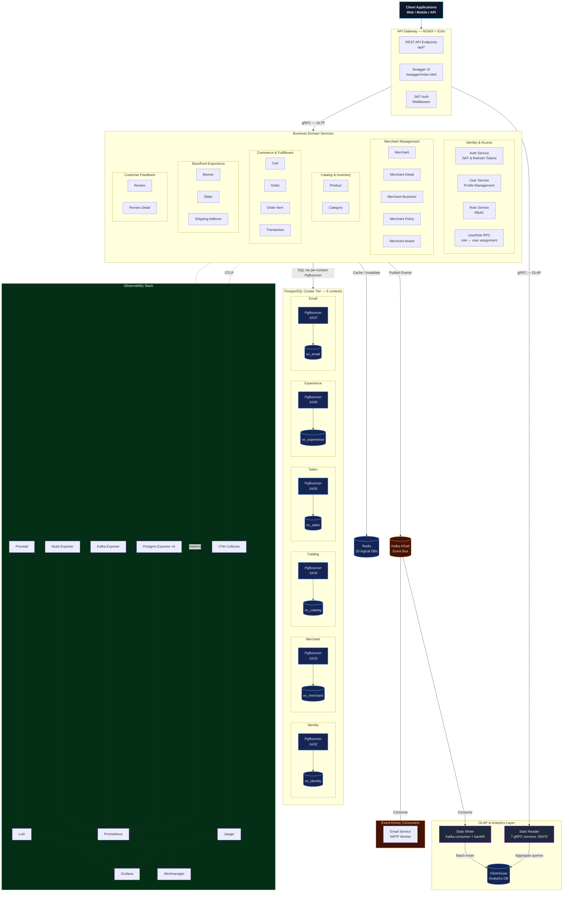
```mermaid
graph TB
    classDef client fill:#0f172a,stroke:#38bdf8,color:#e0f2fe,stroke-width:2px,font-weight:bold
    classDef gateway fill:#1e293b,stroke:#22d3ee,color:#cffafe,stroke-width:2px,font-weight:bold
    classDef domain fill:#1e1b4b,stroke:#818cf8,color:#e0e7ff,stroke-width:1.5px
    classDef infra fill:#172554,stroke:#60a5fa,color:#dbeafe,stroke-width:1.5px
    classDef obs fill:#052e16,stroke:#4ade80,color:#dcfce7,stroke-width:1.5px
    classDef event fill:#431407,stroke:#fb923c,color:#fed7aa,stroke-width:1.5px
    classDef olap fill:#1e293b,stroke:#a855f7,color:#f3e8ff,stroke-width:1.5px

    Client["Client Applications<br/>Web / Mobile / API"]:::client

    subgraph APIGateway["API Gateway — NGINX + Echo"]
        direction LR
        REST["REST API Endpoints<br/>/api/*"]
        Swagger["Swagger UI<br/>/swagger/index.html"]
        AuthMW["JWT Auth<br/>Middleware"]
    end
    class APIGateway gateway

    Client --> APIGateway

    subgraph BusinessServices["Business Domain Services"]
        direction TB

        subgraph IdentityDomain["Identity & Access"]
            AUTH["Auth Service<br/>JWT & Refresh Tokens"]
            USER["User Service<br/>Profile Management"]
            ROLE["Role Service<br/>RBAC"]
            UROLE["UserRole RPC<br/>role ↔ user assignment"]
        end

        subgraph MerchantDomain["Merchant Management"]
            MERCH["Merchant"]
            MDETAIL["Merchant Detail"]
            MBIZ["Merchant Business"]
            MPOL["Merchant Policy"]
            MAWARD["Merchant Award"]
        end

        subgraph CatalogDomain["Catalog & Inventory"]
            PROD["Product"]
            CAT["Category"]
        end

        subgraph CommerceDomain["Commerce & Fulfillment"]
            CART["Cart"]
            ORDER["Order"]
            OITEM["Order Item"]
            TXN["Transaction"]
        end

        subgraph ExperienceDomain["Storefront Experience"]
            BANNER["Banner"]
            SLIDER["Slider"]
            SHIP["Shipping Address"]
        end

        subgraph FeedbackDomain["Customer Feedback"]
            REVIEW["Review"]
            RDETAIL["Review Detail"]
        end
    end
    class BusinessServices domain

    APIGateway -->|"gRPC — OLTP"| BusinessServices

    subgraph OLAPEngine["OLAP & Analytics Layer"]
        direction TB
        WRITER["Stats Writer<br/>Kafka consumer + backfill"]:::olap
        READER["Stats Reader<br/>7 gRPC services :50070"]:::olap
        CLICKHOUSE[("ClickHouse<br/>Analytics DB")]:::infra
    end

    APIGateway -->|"gRPC — OLAP"| READER

    subgraph Persistence["PostgreSQL Cluster Tier — 6 contexts"]
        direction LR
        subgraph IdentityPG["Identity"]
            PGB_ID["PgBouncer<br/>:6432"]:::infra
            PG_ID[("ec_identity")]:::infra
        end
        subgraph MerchantPG["Merchant"]
            PGB_ME["PgBouncer<br/>:6433"]:::infra
            PG_ME[("ec_merchant")]:::infra
        end
        subgraph CatalogPG["Catalog"]
            PGB_CA["PgBouncer<br/>:6434"]:::infra
            PG_CA[("ec_catalog")]:::infra
        end
        subgraph SalesPG["Sales"]
            PGB_SA["PgBouncer<br/>:6435"]:::infra
            PG_SA[("ec_sales")]:::infra
        end
        subgraph ExperiencePG["Experience"]
            PGB_EX["PgBouncer<br/>:6436"]:::infra
            PG_EX[("ec_experience")]:::infra
        end
        subgraph EmailPG["Email"]
            PGB_EM["PgBouncer<br/>:6437"]:::infra
            PG_EM[("ec_email")]:::infra
        end
    end

    PGB_ID --> PG_ID
    PGB_ME --> PG_ME
    PGB_CA --> PG_CA
    PGB_SA --> PG_SA
    PGB_EX --> PG_EX
    PGB_EM --> PG_EM

    BusinessServices -->|"SQL via per-context PgBouncer"| Persistence

    REDIS[("Redis<br/>20 logical DBs")]:::infra
    KAFKA[("Kafka KRaft<br/>Event Bus")]:::event

    BusinessServices -->|"Cache / Invalidate"| REDIS
    BusinessServices -->|"Publish Events"| KAFKA

    subgraph EventConsumers["Event-Driven Consumers"]
        EMAIL["Email Service<br/>SMTP Worker"]
    end
    class EventConsumers event

    KAFKA -->|"Consume"| EMAIL
    KAFKA -->|"Consume"| WRITER
    WRITER -->|"Batch insert"| CLICKHOUSE
    READER -->|"Aggregate queries"| CLICKHOUSE

    subgraph Observability["Observability Stack"]
        direction LR
        PROM["Prometheus"]
        LOKI["Loki"]
        JAEGER["Jaeger"]
        GRAFANA["Grafana"]
        OTEL["OTel Collector"]
        PROMTAIL["Promtail"]
        NODEX["Node Exporter"]
        KAFKAX["Kafka Exporter"]
        PGX["Postgres Exporter ×6"]
        ALERTMGR["Alertmanager"]
    end
    class Observability obs

    BusinessServices -.->|"/metrics"| PROM
    BusinessServices -.->|"OTLP"| OTEL
    OTEL -.-> JAEGER
    PROMTAIL -.-> LOKI
    NODEX -.-> PROM
    KAFKAX -.-> PROM
    PGX -.-> PROM
    PROM -.-> ALERTMGR
    PROM -.-> GRAFANA
    LOKI -.-> GRAFANA
    JAEGER -.-> GRAFANA
```

---

## Service Catalog

The workspace ships **22 domain services**, one REST API gateway, and two operational
jobs (`migrate`, `seeder`).

| # | Service | Bounded Context | gRPC | Metrics | Responsibility |
|---|---------|-----------------|------|---------|----------------|
| 1 | `apigateway` | — | — | `8100` | REST/JSON edge, Swagger UI, JWT middleware, fans out to all gRPC clients |
| 2 | `auth` | identity | `50051` | `8081` | Register, login, refresh token, password reset, OTP |
| 3 | `role` | identity | `50052` | `8082` | Role CRUD + `UserRoleService` (assign / remove / find-by-user) |
| 4 | `user` | identity | `50053` | `8083` | User profile CRUD, soft-delete/restore |
| 5 | `category` | catalog | `50054` | `8084` | Product category CRUD, trash/restore |
| 6 | `merchant` | merchant | `50055` | `8085` | Merchant core registration |
| 7 | `order_item` | sales | `50056` | `8086` | Line-item composition per order |
| 8 | `order` | sales | `50057` | `8087` | Cart checkout, order lifecycle |
| 9 | `product` | catalog | `50058` | `8088` | Product CRUD, stock, pricing |
| 10 | `transaction` | sales | `50059` | `8089` | Payment recording & status |
| 11 | `cart` | experience | `50060` | `8090` | Shopping cart |
| 12 | `review` | experience | `50061` | `8091` | Product reviews |
| 13 | `slider` | experience | `50062` | `8092` | Homepage carousel |
| 14 | `shipping_address` | experience | `50063` | `8093` | Delivery addresses |
| 15 | `banner` | experience | `50064` | `8094` | Promotional banners |
| 16 | `merchant_award` | merchant | `50065` | `8095` | Merchant awards |
| 17 | `merchant_business` | merchant | `50066` | `8096` | Merchant business data |
| 18 | `merchant_detail` | merchant | `50067` | `8097` | Merchant profile details |
| 19 | `merchant_policy` | merchant | `50068` | `8098` | Merchant policies |
| 20 | `review_detail` | experience | `50069` | `8099` | Review line details |
| 21 | `email` | email | — | `8080` | Kafka consumer → SMTP notifications |
| 22 | `stats_writer` | ClickHouse | — | — | Kafka consumer + backfill → ClickHouse |
| 23 | `stats_reader` | ClickHouse | `50070` | — | 7 gRPC analytics services over ClickHouse |
| 24 | `migrate` | all | — | — | Goose migration runner across all 6 contexts |
| 25 | `seeder` | all | — | — | Development seed data |

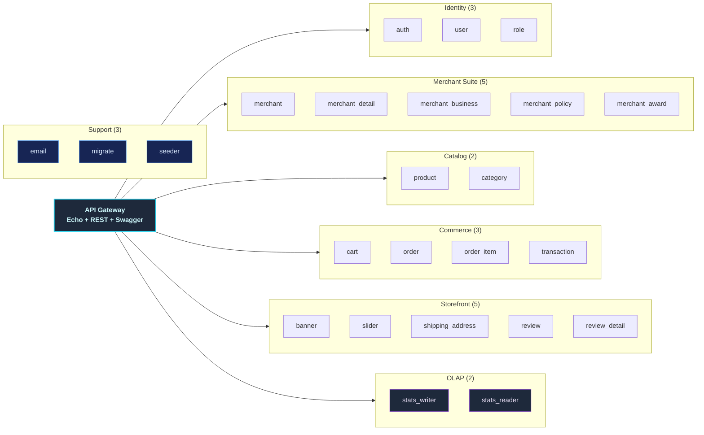
```mermaid
graph LR
    classDef svc fill:#1e1b4b,stroke:#a78bfa,color:#ede9fe,stroke-width:1px
    classDef gw fill:#1e293b,stroke:#22d3ee,color:#cffafe,stroke-width:2px,font-weight:bold
    classDef support fill:#172554,stroke:#60a5fa,color:#dbeafe,stroke-width:1px
    classDef olap fill:#1e293b,stroke:#a855f7,color:#f3e8ff,stroke-width:1px

    API["API Gateway<br/>Echo + REST + Swagger"]:::gw

    subgraph Identity["Identity (3)"]
        A1["auth"]
        A2["user"]
        A3["role"]
    end

    subgraph Merchant["Merchant Suite (5)"]
        M1["merchant"]
        M2["merchant_detail"]
        M3["merchant_business"]
        M4["merchant_policy"]
        M5["merchant_award"]
    end

    subgraph Catalog["Catalog (2)"]
        C1["product"]
        C2["category"]
    end

    subgraph Commerce["Commerce (3)"]
        O1["cart"]
        O2["order"]
        O3["order_item"]
        O4["transaction"]
    end

    subgraph Experience["Storefront (5)"]
        X1["banner"]
        X2["slider"]
        X3["shipping_address"]
        X4["review"]
        X5["review_detail"]
    end

    subgraph OLAP["OLAP (2)"]
        S1["stats_writer"]:::olap
        S2["stats_reader"]:::olap
    end

    subgraph Support["Support (3)"]
        T1["email"]:::support
        T2["migrate"]:::support
        T3["seeder"]:::support
    end

    API --> Identity
    API --> Merchant
    API --> Catalog
    API --> Commerce
    API --> Experience
    API --> OLAP
```

---

## Database Layer — PostgreSQL Cluster & PgBouncer

The e-commerce platform runs **six independent PostgreSQL 17 clusters**, one per bounded context.
"Cluster" here means *one dedicated PostgreSQL instance per context* — not a replicated
primary/replica pair. Isolation is intentional: it makes cross-context schema coupling impossible
by construction, keeps blast radius small, and lets each context be tuned, backed up, and
migrated independently.

**Every cluster sits behind its own PgBouncer pooler.** Services never hold a direct PostgreSQL
connection; they dial the pooler, which multiplexes a bounded set of server connections across
thousands of client connections.

### Topology

| Bounded Context | PostgreSQL instance | Database | PgBouncer (host port) | Pool mode | Owning services |
|-----------------|--------------------|----------|----------------------|-----------|-----------------|
| **Identity** | `postgres_identity` | `ec_identity` | `6432` | `session` | `auth`, `user`, `role` |
| **Merchant** | `postgres_merchant` | `ec_merchant` | `6433` | `session` | `merchant`, `merchant_detail`, `merchant_business`, `merchant_policy`, `merchant_award` |
| **Catalog** | `postgres_catalog` | `ec_catalog` | `6434` | `session` | `product`, `category` |
| **Sales** | `postgres_sales` | `ec_sales` | `6435` | `session` | `order`, `order_item`, `transaction` |
| **Experience** | `postgres_experience` | `ec_experience` | `6436` | `session` | `cart`, `review`, `review_detail`, `slider`, `banner`, `shipping_address` |
| **Email** | `postgres_email` | `ec_email` | `6437` | `session` | `email` |

Each pair is also scraped by a dedicated **postgres-exporter** on host ports `9187`–`9192`
(identity → merchant → catalog → sales → experience → email), so per-context connection
saturation, cache hit ratio, and transaction throughput are all visible in Grafana.

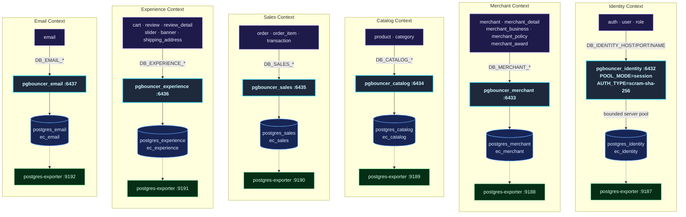
```mermaid
graph TB
    classDef svc fill:#1e1b4b,stroke:#a78bfa,color:#ede9fe,stroke-width:1px
    classDef pool fill:#1e293b,stroke:#22d3ee,color:#cffafe,stroke-width:2px,font-weight:bold
    classDef pg fill:#172554,stroke:#60a5fa,color:#dbeafe,stroke-width:1.5px
    classDef obs fill:#052e16,stroke:#4ade80,color:#dcfce7,stroke-width:1px

    subgraph IdentityCtx["Identity Context"]
        direction TB
        S_ID["auth · user · role"]:::svc
        PGB_ID["pgbouncer_identity :6432<br/>POOL_MODE=session<br/>AUTH_TYPE=scram-sha-256"]:::pool
        PG_ID[("postgres_identity<br/>ec_identity")]:::pg
        PX_ID["postgres-exporter :9187"]:::obs
        S_ID -->|"DB_IDENTITY_HOST/PORT/NAME"| PGB_ID
        PGB_ID -->|"bounded server pool"| PG_ID
        PG_ID -.-> PX_ID
    end

    subgraph MerchantCtx["Merchant Context"]
        direction TB
        S_ME["merchant · merchant_detail<br/>merchant_business · merchant_policy<br/>merchant_award"]:::svc
        PGB_ME["pgbouncer_merchant :6433"]:::pool
        PG_ME[("postgres_merchant<br/>ec_merchant")]:::pg
        PX_ME["postgres-exporter :9188"]:::obs
        S_ME -->|"DB_MERCHANT_*"| PGB_ME
        PGB_ME --> PG_ME
        PG_ME -.-> PX_ME
    end

    subgraph CatalogCtx["Catalog Context"]
        direction TB
        S_CA["product · category"]:::svc
        PGB_CA["pgbouncer_catalog :6434"]:::pool
        PG_CA[("postgres_catalog<br/>ec_catalog")]:::pg
        PX_CA["postgres-exporter :9189"]:::obs
        S_CA -->|"DB_CATALOG_*"| PGB_CA
        PGB_CA --> PG_CA
        PG_CA -.-> PX_CA
    end

    subgraph SalesCtx["Sales Context"]
        direction TB
        S_SA["order · order_item · transaction"]:::svc
        PGB_SA["pgbouncer_sales :6435"]:::pool
        PG_SA[("postgres_sales<br/>ec_sales")]:::pg
        PX_SA["postgres-exporter :9190"]:::obs
        S_SA -->|"DB_SALES_*"| PGB_SA
        PGB_SA --> PG_SA
        PG_SA -.-> PX_SA
    end

    subgraph ExperienceCtx["Experience Context"]
        direction TB
        S_EX["cart · review · review_detail<br/>slider · banner · shipping_address"]:::svc
        PGB_EX["pgbouncer_experience :6436"]:::pool
        PG_EX[("postgres_experience<br/>ec_experience")]:::pg
        PX_EX["postgres-exporter :9191"]:::obs
        S_EX -->|"DB_EXPERIENCE_*"| PGB_EX
        PGB_EX --> PG_EX
        PG_EX -.-> PX_EX
    end

    subgraph EmailCtx["Email Context"]
        direction TB
        S_EM["email"]:::svc
        PGB_EM["pgbouncer_email :6437"]:::pool
        PG_EM[("postgres_email<br/>ec_email")]:::pg
        PX_EM["postgres-exporter :9192"]:::obs
        S_EM -->|"DB_EMAIL_*"| PGB_EM
        PGB_EM --> PG_EM
        PG_EM -.-> PX_EM
    end
```

### Connection Lifecycle

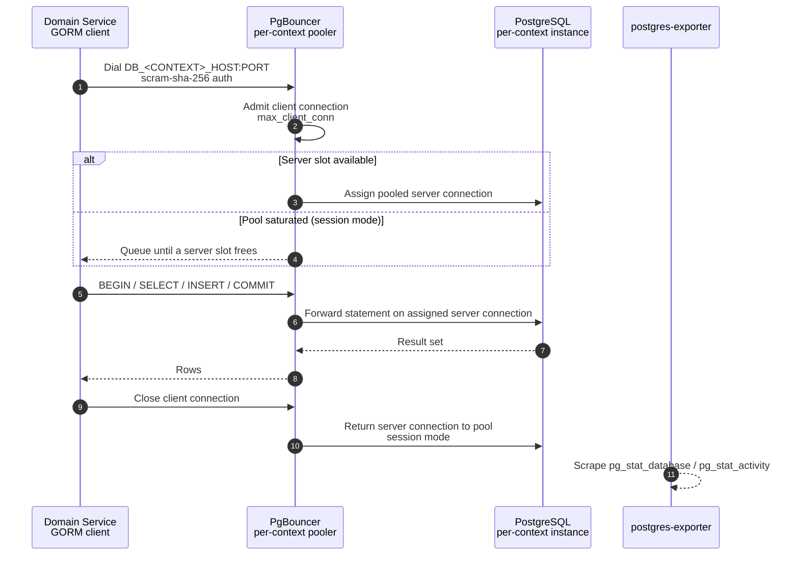
```mermaid
sequenceDiagram
    autonumber
    participant SVC as Domain Service<br/>GORM client
    participant PGB as PgBouncer<br/>per-context pooler
    participant PG as PostgreSQL<br/>per-context instance
    participant PX as postgres-exporter

    SVC->>PGB: Dial DB_<CONTEXT>_HOST:PORT<br/>scram-sha-256 auth
    PGB->>PGB: Admit client connection<br/>max_client_conn
    alt Server slot available
        PGB->>PG: Assign pooled server connection
    else Pool saturated (session mode)
        PGB-->>SVC: Queue until a server slot frees
    end
    SVC->>PGB: BEGIN / SELECT / INSERT / COMMIT
    PGB->>PG: Forward statement on assigned server connection
    PG-->>PGB: Result set
    PGB-->>SVC: Rows
    SVC->>PGB: Close client connection
    PGB->>PG: Return server connection to pool<br/>session mode
    PX-->>PX: Scrape pg_stat_database / pg_stat_activity
```

### Environment Contract

There is **no generic `DB_HOST` / `DB_PORT` / `DB_NAME`**. A service declares which cluster it
belongs to once, in `service/<name>/cmd/main.go`:

```go
server.Config{
    DBCluster: database.IdentityCluster, // → "DB_IDENTITY"
    // ...
}
```

`pkg/database/names.go` is the single source of truth:

| Constant | Env prefix | Database |
|----------|-----------|----------|
| `database.IdentityCluster` | `DB_IDENTITY` | `ec_identity` |
| `database.MerchantCluster` | `DB_MERCHANT` | `ec_merchant` |
| `database.CatalogCluster` | `DB_CATALOG` | `ec_catalog` |
| `database.SalesCluster` | `DB_SALES` | `ec_sales` |
| `database.ExperienceCluster` | `DB_EXPERIENCE` | `ec_experience` |
| `database.EmailCluster` | `DB_EMAIL` | `ec_email` |

Each prefix resolves `<PREFIX>_HOST`, `<PREFIX>_PORT`, `<PREFIX>_NAME` — which point at the
context's **PgBouncer** service, not at PostgreSQL. A missing prefix fails startup rather than
silently falling back to the wrong database. Pool sizing is global: `DB_MAX_OPEN_CONNS`,
`DB_MIN_IDLE_CONNS`, `DB_CONN_MAX_LIFETIME`.

### Migrations & Seeding

`service/migrate` runs **Goose** migrations per context in dependency order —
`identity → merchant → catalog → sales → experience → email` — so foreign-key-shaped
dependencies are created before the contexts that reference them. `service/seeder` populates
development fixtures behind the same per-context connections.

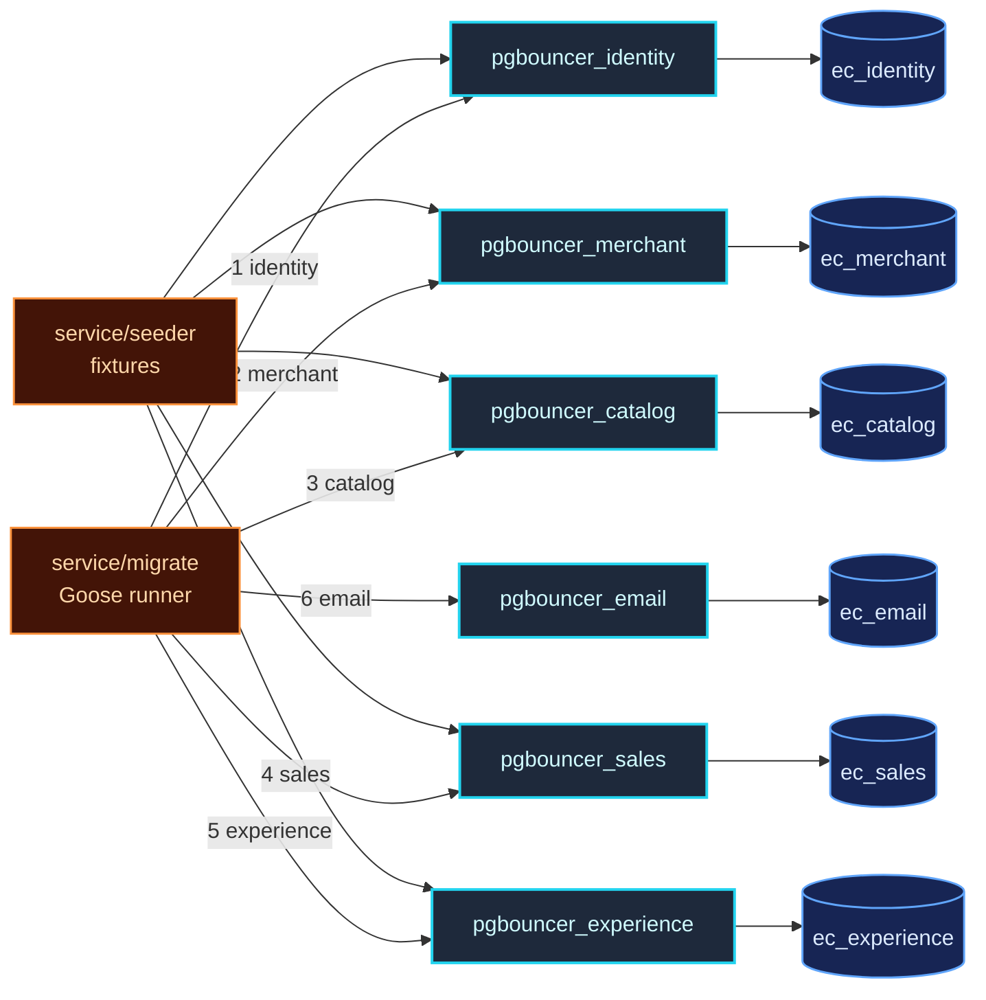
```mermaid
flowchart LR
    classDef job fill:#431407,stroke:#fb923c,color:#fed7aa,stroke-width:1.5px
    classDef pool fill:#1e293b,stroke:#22d3ee,color:#cffafe,stroke-width:2px
    classDef pg fill:#172554,stroke:#60a5fa,color:#dbeafe,stroke-width:1.5px

    MIG["service/migrate<br/>Goose runner"]:::job
    SEED["service/seeder<br/>fixtures"]:::job

    MIG -->|"1 identity"| P1["pgbouncer_identity"]:::pool
    MIG -->|"2 merchant"| P2["pgbouncer_merchant"]:::pool
    MIG -->|"3 catalog"| P3["pgbouncer_catalog"]:::pool
    MIG -->|"4 sales"| P4["pgbouncer_sales"]:::pool
    MIG -->|"5 experience"| P5["pgbouncer_experience"]:::pool
    MIG -->|"6 email"| P6["pgbouncer_email"]:::pool

    SEED --> P1
    SEED --> P2
    SEED --> P3
    SEED --> P4
    SEED --> P5

    P1 --> D1[("ec_identity")]:::pg
    P2 --> D2[("ec_merchant")]:::pg
    P3 --> D3[("ec_catalog")]:::pg
    P4 --> D4[("ec_sales")]:::pg
    P5 --> D5[("ec_experience")]:::pg
    P6 --> D6[("ec_email")]:::pg
```

### Kubernetes Topology

In-cluster the same shape is expressed with a **StatefulSet + PVC** per context and a
**Deployment** per pooler, with a `postgres-network-policy` restricting who may reach each
PostgreSQL pod and a `pgbouncer-network-policy` restricting who may reach each pooler.

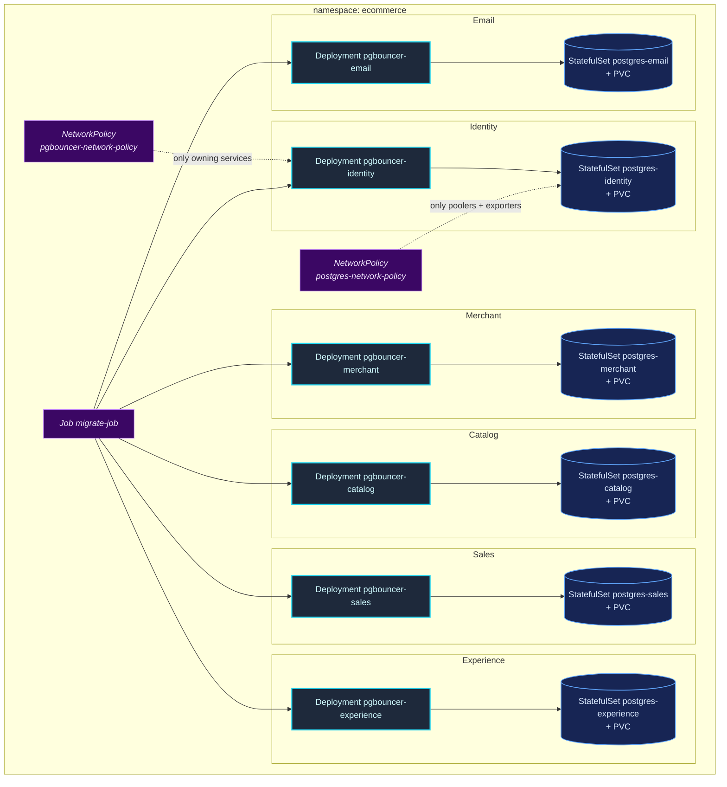
```mermaid
flowchart TB
    classDef pod fill:#1e1b4b,stroke:#a78bfa,color:#ede9fe,stroke-width:1.5px
    classDef pool fill:#1e293b,stroke:#22d3ee,color:#cffafe,stroke-width:2px
    classDef pg fill:#172554,stroke:#60a5fa,color:#dbeafe,stroke-width:1.5px
    classDef np fill:#3b0764,stroke:#c084fc,color:#f3e8ff,stroke-width:1px,font-style:italic

    subgraph NS["namespace: ecommerce"]
        subgraph IdentityK8s["Identity"]
            PK_ID["Deployment pgbouncer-identity"]:::pool
            PS_ID[("StatefulSet postgres-identity<br/>+ PVC")]:::pg
        end
        subgraph MerchantK8s["Merchant"]
            PK_ME["Deployment pgbouncer-merchant"]:::pool
            PS_ME[("StatefulSet postgres-merchant<br/>+ PVC")]:::pg
        end
        subgraph CatalogK8s["Catalog"]
            PK_CA["Deployment pgbouncer-catalog"]:::pool
            PS_CA[("StatefulSet postgres-catalog<br/>+ PVC")]:::pg
        end
        subgraph SalesK8s["Sales"]
            PK_SA["Deployment pgbouncer-sales"]:::pool
            PS_SA[("StatefulSet postgres-sales<br/>+ PVC")]:::pg
        end
        subgraph ExperienceK8s["Experience"]
            PK_EX["Deployment pgbouncer-experience"]:::pool
            PS_EX[("StatefulSet postgres-experience<br/>+ PVC")]:::pg
        end
        subgraph EmailK8s["Email"]
            PK_EM["Deployment pgbouncer-email"]:::pool
            PS_EM[("StatefulSet postgres-email<br/>+ PVC")]:::pg
        end

        NPP["NetworkPolicy<br/>postgres-network-policy"]:::np
        NPB["NetworkPolicy<br/>pgbouncer-network-policy"]:::np
        MIGJOB["Job migrate-job"]:::np
    end

    PK_ID --> PS_ID
    PK_ME --> PS_ME
    PK_CA --> PS_CA
    PK_SA --> PS_SA
    PK_EX --> PS_EX
    PK_EM --> PS_EM

    NPP -.->|"only poolers + exporters"| PS_ID
    NPB -.->|"only owning services"| PK_ID
    MIGJOB --> PK_ID
    MIGJOB --> PK_ME
    MIGJOB --> PK_CA
    MIGJOB --> PK_SA
    MIGJOB --> PK_EX
    MIGJOB --> PK_EM
```

> The PostgreSQL ports are **not** published to the host in either deployment target. Connect
> through the PgBouncer ports (`6432`–`6437`).

---

## Internal Service Architecture

Every business service follows the same clean-architecture layout. Dependencies flow inward;
the domain layer never imports transport or ORM packages.


```mermaid
graph TB
    classDef handler fill:#1e3a5f,stroke:#7dd3fc,color:#e0f2fe,stroke-width:1.5px
    classDef service fill:#1e1b4b,stroke:#a78bfa,color:#ede9fe,stroke-width:1.5px
    classDef repo fill:#172554,stroke:#60a5fa,color:#dbeafe,stroke-width:1.5px
    classDef infra fill:#052e16,stroke:#4ade80,color:#dcfce7,stroke-width:1.5px
    classDef shared fill:#431407,stroke:#fb923c,color:#fed7aa,stroke-width:1.5px

    subgraph Service["service/<name>/"]
        direction TB

        CMD["cmd/main.go<br/>Entry point + DBCluster selection"]

        subgraph Internal["internal wiring"]
            direction TB
            APPS["apps/server.go<br/>Dependency injection"]:::handler
            HANDLER["handler/<br/>gRPC handlers"]:::handler
            MW["middleware/<br/>Interceptors"]:::handler
            SVC["service/<br/>Business logic"]:::service
            CACHE["cache/<br/>Redis cache layer"]:::service
            REPO["repository/<br/>Data access — GORM"]:::repo
        end

        CMD --> APPS
        APPS --> HANDLER
        APPS --> SVC
        APPS --> CACHE
        APPS --> REPO
        HANDLER --> SVC
        SVC --> REPO
        SVC --> CACHE
    end

    subgraph SharedLibs["shared/ — Shared Libraries"]
        direction LR
        DOMAIN["domain/<br/>record / request / response"]:::shared
        OBS["observability/<br/>cache & tracing metrics"]:::shared
        CACHESHARED["cache/<br/>redis_cache.go"]:::shared
        MAPPER["mapper/<br/>Domain ↔ Proto"]:::shared
        ERRORS["errors/ + errorhandler/"]:::shared
    end

    subgraph PkgLibs["pkg/ — Platform Libraries"]
        direction LR
        PKGAUTH["auth/<br/>JWT manager"]:::infra
        PKGKAFKA["kafka/<br/>Producer / consumer"]:::infra
        PKGOTEL["otel/<br/>Tracing + metrics init"]:::infra
        PKGRES["resilience/<br/>Circuit breaker, rate limiter,<br/>load monitor, DependencyGuard"]:::infra
        PKGLOG["logger/<br/>Zap structured logging"]:::infra
        PKGSRV["server/<br/>gRPC bootstrap"]:::infra
        PKGDB["database/<br/>Per-context GORM + Goose + names.go"]:::infra
        PKGCH["clickhouse/<br/>OLAP connection + schema"]:::infra
        PKGADAPTER["adapter/role · adapter/user_role<br/>guarded gRPC clients"]:::infra
    end

    PB["pb/<br/>Generated protobuf Go code"]:::shared
    PGB_EXT["PgBouncer per context"]:::infra

    REPO --> DOMAIN
    REPO --> PGB_EXT
    SVC --> DOMAIN
    SVC --> OBS
    HANDLER --> PB
    HANDLER --> MAPPER
    APPS --> PKGSRV
    APPS --> PKGOTEL
    APPS --> CACHESHARED
    APPS --> PKGADAPTER
    APPS --> OBS
```

### Cross-Context Access: the Adapter Pattern

`service/auth` and `service/user` need role data but must not open a second database
connection. They use typed gRPC adapters instead, each wrapped in a `DependencyGuard`
(per-call timeout + circuit breaker + bulkhead):

| Adapter | Package | Backing RPC | Used by |
|---------|---------|-------------|---------|
| `RoleAdapter` | `pkg/adapter/role` | `RoleService` — `FindById`, `FindByName` | `service/auth`, `service/user` |
| `UserRoleAdapter` | `pkg/adapter/user_role` | `UserRoleService` — `FindByUserId`, `AssignRoleToUser`, `RemoveRoleFromUser` | `service/auth`, `service/apigateway` |

---

## Data & Event Flow

### Synchronous Flow — REST → gRPC → Redis → PgBouncer → PostgreSQL

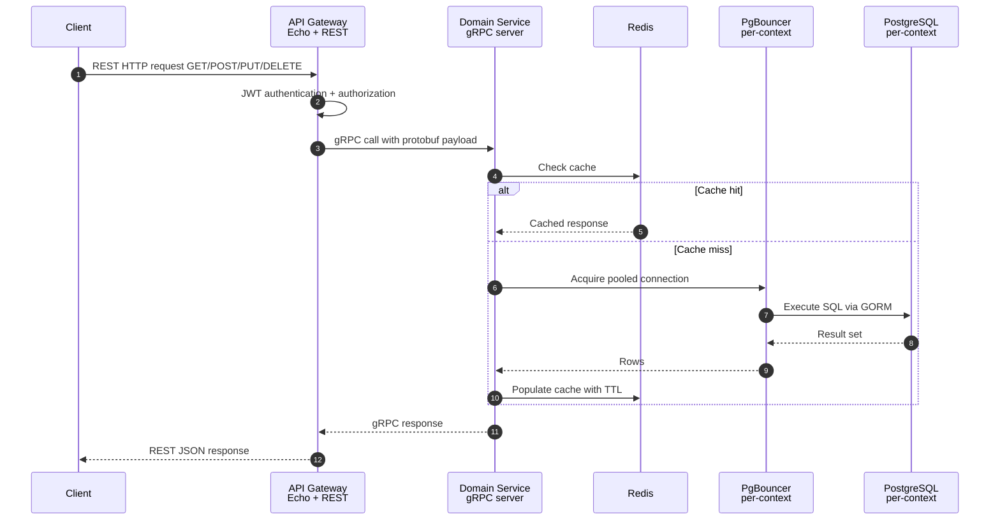
```mermaid
sequenceDiagram
    autonumber
    participant C as Client
    participant GW as API Gateway<br/>Echo + REST
    participant SVC as Domain Service<br/>gRPC server
    participant REDIS as Redis
    participant PGB as PgBouncer<br/>per-context
    participant DB as PostgreSQL<br/>per-context

    C->>GW: REST HTTP request GET/POST/PUT/DELETE
    GW->>GW: JWT authentication + authorization
    GW->>SVC: gRPC call with protobuf payload
    SVC->>REDIS: Check cache
    alt Cache hit
        REDIS-->>SVC: Cached response
    else Cache miss
        SVC->>PGB: Acquire pooled connection
        PGB->>DB: Execute SQL via GORM
        DB-->>PGB: Result set
        PGB-->>SVC: Rows
        SVC->>REDIS: Populate cache with TTL
    end
    SVC-->>GW: gRPC response
    GW-->>C: REST JSON response
```

### Asynchronous Flow — Kafka Email Notifications

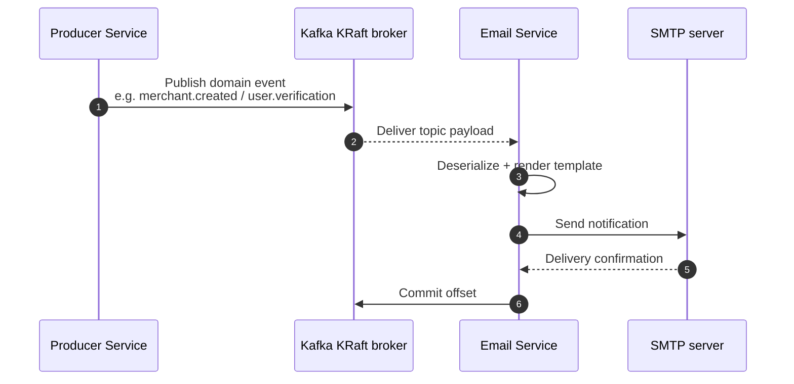
```mermaid
sequenceDiagram
    autonumber
    participant SVC as Producer Service
    participant K as Kafka KRaft broker
    participant EMAIL as Email Service
    participant SMTP as SMTP server

    SVC->>K: Publish domain event<br/>e.g. merchant.created / user.verification
    K-->>EMAIL: Deliver topic payload
    EMAIL->>EMAIL: Deserialize + render template
    EMAIL->>SMTP: Send notification
    SMTP-->>EMAIL: Delivery confirmation
    EMAIL->>K: Commit offset
```

### Cross-Context Flow — Adapter with DependencyGuard

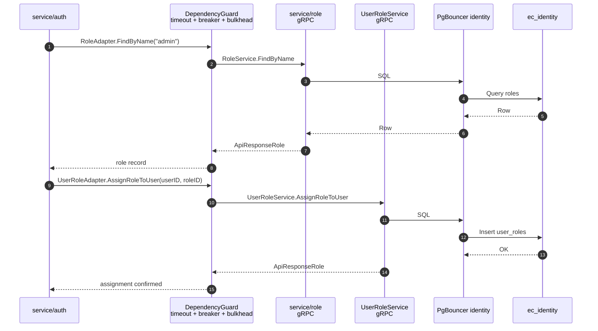
```mermaid
sequenceDiagram
    autonumber
    participant AUTH as service/auth
    participant GUARD as DependencyGuard<br/>timeout + breaker + bulkhead
    participant ROLE as service/role<br/>gRPC
    participant UROLE as UserRoleService<br/>gRPC
    participant PGB as PgBouncer identity
    participant DB as ec_identity

    AUTH->>GUARD: RoleAdapter.FindByName("admin")
    GUARD->>ROLE: RoleService.FindByName
    ROLE->>PGB: SQL
    PGB->>DB: Query roles
    DB-->>PGB: Row
    PGB-->>ROLE: Row
    ROLE-->>GUARD: ApiResponseRole
    GUARD-->>AUTH: role record
    AUTH->>GUARD: UserRoleAdapter.AssignRoleToUser(userID, roleID)
    GUARD->>UROLE: UserRoleService.AssignRoleToUser
    UROLE->>PGB: SQL
    PGB->>DB: Insert user_roles
    DB-->>PGB: OK
    UROLE-->>GUARD: ApiResponseRole
    GUARD-->>AUTH: assignment confirmed
```

---

## OLAP Analytics Layer

Transactional writes stay in PostgreSQL. Analytical reads never touch it — they go to
**ClickHouse** through the `stats_reader` gRPC service, which the API Gateway calls with
cache-aside Redis (5-minute TTL).

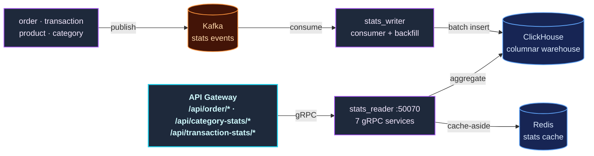
```mermaid
graph LR
    classDef olap fill:#1e293b,stroke:#a855f7,color:#f3e8ff,stroke-width:1.5px
    classDef store fill:#172554,stroke:#60a5fa,color:#dbeafe,stroke-width:1.5px
    classDef api fill:#1e293b,stroke:#22d3ee,color:#cffafe,stroke-width:2px,font-weight:bold
    classDef bus fill:#431407,stroke:#fb923c,color:#fed7aa,stroke-width:1.5px

    TXN["order · transaction<br/>product · category"]:::olap
    KAFKA[("Kafka<br/>stats events")]:::bus
    WRITER["stats_writer<br/>consumer + backfill"]:::olap
    CH[("ClickHouse<br/>columnar warehouse")]:::store
    READER["stats_reader :50070<br/>7 gRPC services"]:::olap
    GW["API Gateway<br/>/api/order/* · /api/category-stats/*<br/>/api/transaction-stats/*"]:::api
    REDIS[("Redis<br/>stats cache")]:::store

    TXN -->|"publish"| KAFKA
    KAFKA -->|"consume"| WRITER
    WRITER -->|"batch insert"| CH
    GW -->|"gRPC"| READER
    READER -->|"aggregate"| CH
    READER -->|"cache-aside"| REDIS
```

`stats_reader` exposes **7 gRPC services** on a single server (`GRPC_STATS_READER_ADDR`, default
`stats_reader:50070`), backed by 36 REST routes:

| Stats service | Proto | Example REST route |
|---------------|-------|--------------------|
| `OrderStatsService` | `proto/order/stats/order_stats.proto` | `/api/order/monthly-revenue` |
| `OrderStatsByMerchantService` | `proto/order/stats/order_statsbymerchant.proto` | `/api/order/merchant/monthly` |
| `CategoryStatsService` | `proto/category/stats/category_stats.proto` | `/api/category-stats/monthly` |
| `CategoryStatsByIdService` | `proto/category/stats/category_stats_byid.proto` | `/api/category-stats/{id}/monthly` |
| `CategoryStatsByMerchantService` | `proto/category/stats/category_stats_bymerchant.proto` | `/api/category-stats/merchant/{id}` |
| `TransactionStatsService` | `proto/transaction/stats/transaction_stats.proto` | `/api/transaction-stats/yearly-success` |
| `TransactionStatsByMerchantService` | `proto/transaction/stats/transaction_stats_bymerchant.proto` | `/api/transaction-stats/merchant/{id}` |

---

## Observability Architecture

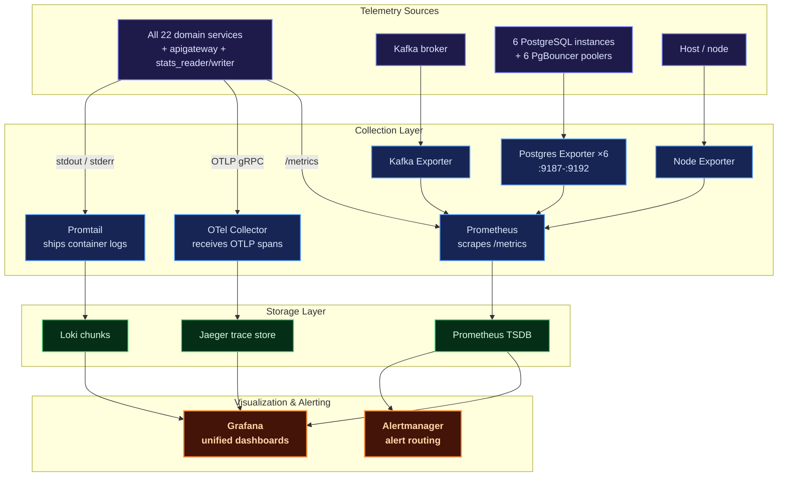
```mermaid
graph TB
    classDef service fill:#1e1b4b,stroke:#818cf8,color:#e0e7ff,stroke-width:1.5px
    classDef collector fill:#172554,stroke:#60a5fa,color:#dbeafe,stroke-width:1.5px
    classDef storage fill:#052e16,stroke:#4ade80,color:#dcfce7,stroke-width:1.5px
    classDef viz fill:#431407,stroke:#fb923c,color:#fed7aa,stroke-width:2px,font-weight:bold

    subgraph Sources["Telemetry Sources"]
        direction TB
        SVCS["All 22 domain services<br/>+ apigateway + stats_reader/writer"]:::service
        KAFKA_SRC["Kafka broker"]:::service
        PG_SRC["6 PostgreSQL instances<br/>+ 6 PgBouncer poolers"]:::service
        NODES["Host / node"]:::service
    end

    subgraph Collectors["Collection Layer"]
        direction TB
        PROM["Prometheus<br/>scrapes /metrics"]:::collector
        PROMTAIL["Promtail<br/>ships container logs"]:::collector
        OTEL["OTel Collector<br/>receives OTLP spans"]:::collector
        NODEX["Node Exporter"]:::collector
        KAFKAX["Kafka Exporter"]:::collector
        PGX["Postgres Exporter ×6<br/>:9187-:9192"]:::collector
    end

    subgraph Storage["Storage Layer"]
        direction TB
        PROM_TSDB["Prometheus TSDB"]:::storage
        LOKI_STORE["Loki chunks"]:::storage
        JAEGER_STORE["Jaeger trace store"]:::storage
    end

    subgraph Visualization["Visualization & Alerting"]
        GRAFANA["Grafana<br/>unified dashboards"]:::viz
        ALERTMGR["Alertmanager<br/>alert routing"]:::viz
    end

    SVCS -->|"/metrics"| PROM
    SVCS -->|"OTLP gRPC"| OTEL
    SVCS -->|"stdout / stderr"| PROMTAIL
    NODES --> NODEX
    KAFKA_SRC --> KAFKAX
    PG_SRC --> PGX

    NODEX --> PROM
    KAFKAX --> PROM
    PGX --> PROM
    PROM --> PROM_TSDB
    PROMTAIL --> LOKI_STORE
    OTEL --> JAEGER_STORE

    PROM_TSDB --> GRAFANA
    LOKI_STORE --> GRAFANA
    JAEGER_STORE --> GRAFANA
    PROM_TSDB --> ALERTMGR
```

| Pillar | Tooling | What you get |
|--------|---------|--------------|
| **Metrics** | Prometheus + Grafana | Request rate, error rate, latency percentiles, cache hit ratio, gRPC client/server latency, DB pool saturation |
| **Logging** | Loki + Promtail | Structured Zap JSON from every service, queryable with LogQL in Grafana |
| **Tracing** | Jaeger + OpenTelemetry | End-to-end traces spanning REST → gRPC → PostgreSQL / ClickHouse / Kafka |
| **Alerting** | Alertmanager | Routing for latency, error-budget, and database-saturation rules |

---

## Deployment Architectures

### Docker Compose (Local Development)

Two compose files live under `deployments/local/`:

- **`docker-compose.yml`** — the whole platform: 6 PostgreSQL + 6 PgBouncer + 6 postgres-exporters,
  Redis, Kafka, ClickHouse, NGINX, every Go service, and the observability stack.
- **`docker-compose.infra.yml`** — infrastructure only, for running the Go services natively with
  `go run service/<name>/cmd/main.go`. Host-side PgBouncer ports `6432`–`6437` are published so
  host processes can reach their context's cluster.


```mermaid
flowchart TD
    classDef gateway fill:#1e293b,stroke:#22d3ee,color:#cffafe,stroke-width:2px,font-weight:bold
    classDef core fill:#1e1b4b,stroke:#a78bfa,color:#ede9fe,stroke-width:1.5px
    classDef infra fill:#172554,stroke:#60a5fa,color:#dbeafe,stroke-width:1.5px
    classDef obs fill:#052e16,stroke:#4ade80,color:#dcfce7,stroke-width:1.5px
    classDef event fill:#431407,stroke:#fb923c,color:#fed7aa,stroke-width:1.5px
    classDef olap fill:#1e293b,stroke:#a855f7,color:#f3e8ff,stroke-width:1.5px

    subgraph DockerCompose["docker-compose.yml — Local Environment"]

        subgraph Gateway["Edge"]
            NGINX["NGINX :80"]
            APIGW["API Gateway :5000<br/>Echo + REST + Swagger"]:::gateway
        end

        subgraph Services["Domain Service Containers"]
            direction TB
            subgraph IdSvc["Identity"]
                AUTH["auth :50051"]
                ROLE["role :50052"]
                USER["user :50053"]
            end
            subgraph MeSvc["Merchant Suite"]
                MERCH["merchant :50055"]
                MDETAIL["merchant_detail :50067"]
                MBIZ["merchant_business :50066"]
                MPOL["merchant_policy :50068"]
                MAWARD["merchant_award :50065"]
            end
            subgraph CaSvc["Catalog"]
                CAT["category :50054"]
                PROD["product :50058"]
            end
            subgraph SaSvc["Commerce"]
                OITEM["order_item :50056"]
                ORDER["order :50057"]
                TXN["transaction :50059"]
            end
            subgraph ExSvc["Experience"]
                CART["cart :50060"]
                REVIEW["review :50061"]
                SLIDER["slider :50062"]
                SHIP["shipping_address :50063"]
                BANNER["banner :50064"]
                RDETAIL["review_detail :50069"]
            end
        end
        class Services core

        subgraph Infra["Infrastructure"]
            direction TB
            subgraph PGTier["6 × PostgreSQL 17 — each behind its own PgBouncer"]
                PG1[("identity :6432")]
                PG2[("merchant :6433")]
                PG3[("catalog :6434")]
                PG4[("sales :6435")]
                PG5[("experience :6436")]
                PG6[("email :6437")]
            end
            REDIS[("Redis :6379<br/>20 logical DBs")]:::infra
            KAFKA[("Kafka :9092")]:::event
            CH[("ClickHouse :9000 / :8123")]:::infra
        end

        subgraph Obs["Observability"]
            PROM["Prometheus :9090"]
            GRAFANA["Grafana :3000"]
            LOKI["Loki :3100"]
            JAEGER["Jaeger :16686"]
            OTEL["OTel Collector :4317"]
            NODEX["Node Exporter"]
            KAFKAX["Kafka Exporter :9308"]
            PGX["Postgres Exporters :9187-:9192"]
            ALERTMGR["Alertmanager :9093"]
            PROMTAIL["Promtail"]
        end
        class Obs obs

        subgraph Events["Event Consumers & OLAP"]
            EMAIL["Email Worker"]:::event
            WRITER["stats_writer"]:::olap
            READER["stats_reader :50070"]:::olap
        end
    end

    NGINX --> APIGW
    APIGW -->|"gRPC"| Services
    APIGW -->|"gRPC"| READER
    Services -->|"SQL via PgBouncer"| PGTier
    Services --> REDIS
    Services --> KAFKA
    KAFKA --> EMAIL
    KAFKA --> WRITER
    WRITER --> CH
    READER --> CH

    Services -.->|"/metrics"| PROM
    Services -.->|"OTLP"| OTEL
    OTEL -.-> JAEGER
    PROMTAIL -.-> LOKI
    NODEX -.-> PROM
    KAFKAX -.-> PROM
    PGX -.-> PROM
    PROM -.-> ALERTMGR
    PROM -.-> GRAFANA
    LOKI -.-> GRAFANA
```

### Kubernetes (Production) + ArgoCD GitOps

Production lives in the `ecommerce` namespace: one Deployment + Service + HPA per domain service,
one StatefulSet + PVC per PostgreSQL context, one Deployment per PgBouncer pooler, plus
NetworkPolicies that enforce the "only the owning context may connect" rule. Delivery is
GitOps-driven through ArgoCD (`deployments/gitops/argocd/`), with overlays under
`deployments/kubernetes/overlays/` and promotion tooling (`promote-image.sh`,
`validate-production.sh`).

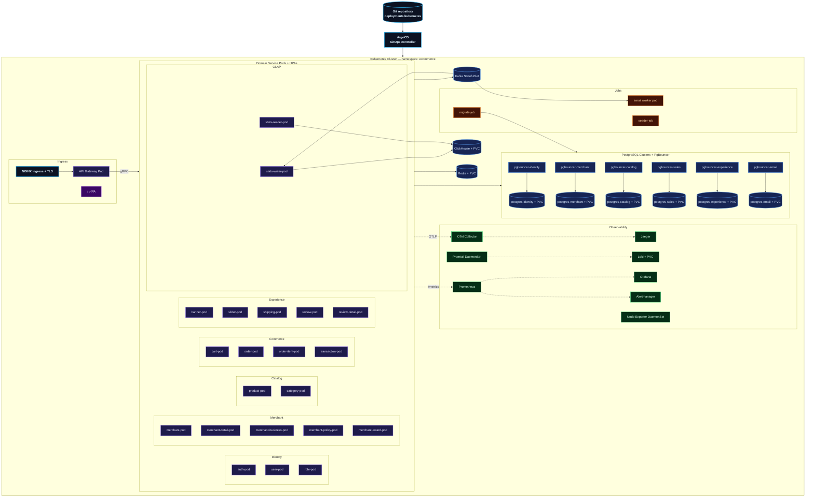
```mermaid
flowchart TD
    classDef k8s fill:#0c1222,stroke:#38bdf8,color:#e0f2fe,stroke-width:2px,font-weight:bold
    classDef pod fill:#1e1b4b,stroke:#a78bfa,color:#ede9fe,stroke-width:1.5px
    classDef hpa fill:#3b0764,stroke:#c084fc,color:#f3e8ff,stroke-width:1px,font-style:italic
    classDef infra fill:#172554,stroke:#60a5fa,color:#dbeafe,stroke-width:1.5px
    classDef obs fill:#052e16,stroke:#4ade80,color:#dcfce7,stroke-width:1.5px
    classDef job fill:#431407,stroke:#fb923c,color:#fed7aa,stroke-width:1.5px

    ARGO["ArgoCD<br/>GitOps controller"]:::k8s
    REPO[("Git repository<br/>deployments/kubernetes")]:::k8s

    subgraph K8S["Kubernetes Cluster — namespace: ecommerce"]

        subgraph Ingress["Ingress"]
            NGINX["NGINX Ingress + TLS"]:::k8s
            APIGW["API Gateway Pod"]:::pod
            APIGW_HPA["↕ HPA"]:::hpa
        end

        subgraph CorePods["Domain Service Pods + HPAs"]
            direction TB
            subgraph IdentityPods["Identity"]
                AUTH["auth-pod"]:::pod
                USER["user-pod"]:::pod
                ROLE["role-pod"]:::pod
            end
            subgraph MerchantPods["Merchant"]
                MERCH["merchant-pod"]:::pod
                MDETAIL["merchant-detail-pod"]:::pod
                MBIZ["merchant-business-pod"]:::pod
                MPOL["merchant-policy-pod"]:::pod
                MAWARD["merchant-award-pod"]:::pod
            end
            subgraph CatalogPods["Catalog"]
                PROD["product-pod"]:::pod
                CAT["category-pod"]:::pod
            end
            subgraph CommercePods["Commerce"]
                CART["cart-pod"]:::pod
                ORDER["order-pod"]:::pod
                OITEM["order-item-pod"]:::pod
                TXN["transaction-pod"]:::pod
            end
            subgraph ExperiencePods["Experience"]
                BANNER["banner-pod"]:::pod
                SLIDER["slider-pod"]:::pod
                SHIP["shipping-pod"]:::pod
                REVIEW["review-pod"]:::pod
                RDETAIL["review-detail-pod"]:::pod
            end
            subgraph OLAPPods["OLAP"]
                SWRITER["stats-writer-pod"]:::pod
                SREADER["stats-reader-pod"]:::pod
            end
        end

        subgraph DataPods["PostgreSQL Clusters + PgBouncer"]
            direction TB
            PGB_ID["pgbouncer-identity"]:::infra
            PG_ID[("postgres-identity + PVC")]:::infra
            PGB_ME["pgbouncer-merchant"]:::infra
            PG_ME[("postgres-merchant + PVC")]:::infra
            PGB_CA["pgbouncer-catalog"]:::infra
            PG_CA[("postgres-catalog + PVC")]:::infra
            PGB_SA["pgbouncer-sales"]:::infra
            PG_SA[("postgres-sales + PVC")]:::infra
            PGB_EX["pgbouncer-experience"]:::infra
            PG_EX[("postgres-experience + PVC")]:::infra
            PGB_EM["pgbouncer-email"]:::infra
            PG_EM[("postgres-email + PVC")]:::infra
        end

        REDIS_CLUSTER[("Redis + PVC")]:::infra
        KAFKA[("Kafka StatefulSet")]:::infra
        CLICKHOUSE[("ClickHouse + PVC")]:::infra

        subgraph ObsPods["Observability"]
            PROM["Prometheus"]:::obs
            GRAFANA["Grafana"]:::obs
            LOKI["Loki + PVC"]:::obs
            PROMTAIL["Promtail DaemonSet"]:::obs
            JAEGER["Jaeger"]:::obs
            OTEL["OTel Collector"]:::obs
            NODEX["Node Exporter DaemonSet"]:::obs
            ALERTMGR["Alertmanager"]:::obs
        end

        subgraph Jobs["Jobs"]
            MIGRATE["migrate-job"]:::job
            SEEDER["seeder-job"]:::job
            EMAILJ["email worker pod"]:::job
        end
    end

    REPO --> ARGO
    ARGO --> K8S

    NGINX --> APIGW
    APIGW -->|"gRPC"| CorePods
    CorePods --> DataPods
    CorePods --> REDIS_CLUSTER
    CorePods --> KAFKA
    KAFKA --> EMAILJ
    KAFKA --> SWRITER
    SWRITER --> CLICKHOUSE
    SREADER --> CLICKHOUSE

    PGB_ID --> PG_ID
    PGB_ME --> PG_ME
    PGB_CA --> PG_CA
    PGB_SA --> PG_SA
    PGB_EX --> PG_EX
    PGB_EM --> PG_EM

    CorePods -.->|"/metrics"| PROM
    CorePods -.->|"OTLP"| OTEL
    OTEL -.-> JAEGER
    PROMTAIL -.-> LOKI
    PROM -.-> GRAFANA
    PROM -.-> ALERTMGR
    MIGRATE --> DataPods
```

---

## Technology Stack

| Category | Technology | Purpose |
|----------|-----------|---------|
| **Language** | Go (Golang) | High-performance, statically typed backend |
| **API Framework** | Echo | REST API gateway with auto-generated Swagger UI |
| **RPC** | gRPC + Protobuf | Contract-first, high-performance inter-service communication |
| **OLTP Database** | PostgreSQL 17 ×6 | Database-per-bounded-context: `ec_identity`, `ec_merchant`, `ec_catalog`, `ec_sales`, `ec_experience`, `ec_email` |
| **Connection Pooler** | PgBouncer ×6 | One pooler per cluster (`session` mode, `scram-sha-256`), host ports `6432`–`6437` |
| **OLAP Database** | ClickHouse | Columnar warehouse for analytics aggregations |
| **ORM** | GORM | Object-relational mapping & query builder |
| **Migrations** | Goose | Schema versioning, applied per bounded context |
| **Caching** | Redis | 20 logical databases with instrumented cache metrics |
| **Messaging** | Apache Kafka (KRaft) | Asynchronous event bus; no Zookeeper dependency |
| **Auth** | JWT | Stateless access/refresh token authentication |
| **Logging** | Zap | High-performance structured logging |
| **Metrics** | Prometheus | Scraping, recording rules, and alert rules |
| **Tracing** | Jaeger + OpenTelemetry | Distributed trace collection and visualization |
| **Log Aggregation** | Loki + Promtail | Centralized log storage and shipping |
| **Dashboards** | Grafana | Unified metric, log, and trace visualization |
| **Alerting** | Alertmanager | Alert routing and notification dispatch |
| **Exporters** | Postgres ×6, Kafka, Node | Database, broker, and host-level metrics |
| **Reverse Proxy** | NGINX | Routing, load balancing, TLS termination |
| **Containerization** | Docker + Docker Compose | Image builds and local orchestration |
| **Orchestration** | Kubernetes + HPA | Production orchestration with per-service autoscaling |
| **GitOps** | ArgoCD | Declarative continuous delivery |
| **API Docs** | Swagger (swaggo) | Interactive API documentation |
| **Resilience** | `pkg/resilience` | Circuit breaker, rate limiter, load monitor, `DependencyGuard` |

---

## Getting Started

### Prerequisites

- [Git](https://git-scm.com/)
- [Go](https://go.dev/) (v1.23+)
- [Docker](https://www.docker.com/) & [Docker Compose](https://docs.docker.com/compose/)
- [Just](https://github.com/casey/just) (task runner)
- `protoc` 3.21.x, `protoc-gen-go`, `protoc-gen-go-grpc` (proto regeneration)
- `swag` (Swagger regeneration)

### 1. Clone the Repository

```sh
git clone https://github.com/MamangRust/microservice-ecommerce-grpc.git
cd microservice-ecommerce-grpc
```

### 2. Configure Environment

```sh
cp .env.example .env
cp deployments/local/docker.env.example deployments/local/docker.env
```

`docker.env` is where the PostgreSQL cluster contract lives. Example for two contexts:

```dotenv
# Host = the context's PgBouncer service, never PostgreSQL itself
DB_IDENTITY_HOST=pgbouncer_identity
DB_IDENTITY_PORT=5432
DB_IDENTITY_NAME=ec_identity

DB_SALES_HOST=pgbouncer_sales
DB_SALES_PORT=5432
DB_SALES_NAME=ec_sales

DB_MAX_OPEN_CONNS=10
DB_MIN_IDLE_CONNS=2
DB_CONN_MAX_LIFETIME=30m
```

For **native** (non-containerized) runs against `docker-compose.infra.yml`, point the hosts at
`localhost` and the ports at the published pooler ports `6432`–`6437`.

### 3. Build & Launch (Docker Compose)

```sh
just build-up      # build service images and start the full stack
just migrate       # run Goose migrations across all 6 contexts
just seeder        # optional: seed development fixtures
```

Verify:

```sh
docker compose -f deployments/local/docker-compose.yml ps
```

### 4. Infra-Only Mode (Native Services)

```sh
# 6 PostgreSQL + 6 PgBouncer, Redis, Kafka, ClickHouse, observability
docker compose -f deployments/local/docker-compose.infra.yml up -d

# then run services directly against localhost:6432-6437
go run service/auth/cmd/main.go
```

### 5. Access Services

| Service | URL |
|---------|-----|
| Swagger UI (via Nginx) | `http://localhost/swagger/index.html` |
| REST API Base (via Nginx) | `http://localhost/api/` |
| Swagger UI (Direct) | `http://localhost:5000/swagger/index.html` |
| REST API Base (Direct) | `http://localhost:5000/api/` |
| Grafana | `http://localhost:3000` |
| Prometheus | `http://localhost:9090` |
| Jaeger UI | `http://localhost:16686` |
| Alertmanager | `http://localhost:9093` |
| Loki (via Grafana) | `http://localhost:3000` → Explore → Loki |

### Stopping the Platform

```sh
just down
```

---

## Port Map Registry

| Service | gRPC | Metrics |
|---------|------|---------|
| `auth` | `50051` | `8081` |
| `role` | `50052` | `8082` |
| `user` | `50053` | `8083` |
| `category` | `50054` | `8084` |
| `merchant` | `50055` | `8085` |
| `order_item` | `50056` | `8086` |
| `order` | `50057` | `8087` |
| `product` | `50058` | `8088` |
| `transaction` | `50059` | `8089` |
| `cart` | `50060` | `8090` |
| `review` | `50061` | `8091` |
| `slider` | `50062` | `8092` |
| `shipping_address` | `50063` | `8093` |
| `banner` | `50064` | `8094` |
| `merchant_award` | `50065` | `8095` |
| `merchant_business` | `50066` | `8096` |
| `merchant_detail` | `50067` | `8097` |
| `merchant_policy` | `50068` | `8098` |
| `review_detail` | `50069` | `8099` |
| `email` | — | `8080` |
| `apigateway` | — | `8100` (REST `5000`) |
| `stats_reader` | `50070` | — |

| Infrastructure | Port |
|----------------|------|
| PgBouncer — identity (`ec_identity`) | `6432` |
| PgBouncer — merchant (`ec_merchant`) | `6433` |
| PgBouncer — catalog (`ec_catalog`) | `6434` |
| PgBouncer — sales (`ec_sales`) | `6435` |
| PgBouncer — experience (`ec_experience`) | `6436` |
| PgBouncer — email (`ec_email`) | `6437` |
| Postgres exporters | `9187` – `9192` |
| Redis | `6379` |
| Kafka | `9092` |
| ClickHouse native / HTTP | `9000` / `8123` |

> PostgreSQL itself is never published to the host — always connect through PgBouncer.

---

## Justfile Reference

| Command | Description |
|---------|-------------|
| `just build-up` | Build service images, then start the local Compose stack |
| `just up` | Start Compose using already-built images |
| `just down` | Stop and remove Compose containers |
| `just migrate` | Run Goose migrations across all six contexts |
| `just migrate-down` | Roll back one migration |
| `just seeder` | Run the database seeder |
| `just generate-proto` | Regenerate Go code from `proto/` |
| `just generate-swagger` | Regenerate Swagger/OpenAPI documentation |
| `just build-image` | Build images for every service |
| `just test-unit` | Run `pkg` unit tests |
| `just test-integration` | Run integration tests from the `tests` module |
| `just test-all` | Unit + integration |

Kubernetes targets are driven by the manifests and cluster tooling under `deployments/` —
see `deployments/kubernetes/README.md` and `PRODUCTION_RUNBOOK.md`.

---

## Project Structure

```
microservice-ecommerce-grpc/
├── proto/                          # Protobuf contracts, incl. {order,category,transaction}/stats
│   ├── user_role/                  #   UserRole service (assign / remove / find-by-user)
│   └── role/                       #   Role query + command services
├── pb/                             # Generated protobuf Go code (own module)
├── shared/                         # Shared Go module
│   ├── domain/                     #   record / request / response models
│   ├── mapper/                     #   Domain ↔ Proto mappers (incl. mapper/stats)
│   ├── cache/                      #   Redis cache abstraction
│   ├── observability/              #   Cache metrics + tracing metrics
│   ├── errors/                     #   Custom error types
│   └── errorhandler/               #   Error handling utilities
├── pkg/                            # Platform Go module
│   ├── adapter/                    #   Guarded gRPC adapters (role, user_role)
│   ├── auth/                       #   JWT token manager
│   ├── database/                   #   Per-context GORM, Goose, names.go (cluster constants)
│   ├── kafka/                      #   Kafka producer / consumer
│   ├── clickhouse/                 #   ClickHouse connection + schema.sql
│   ├── otel/                       #   OpenTelemetry init
│   ├── resilience/                 #   Circuit breaker, rate limiter, load monitor, DependencyGuard
│   ├── logger/                     #   Zap structured logger
│   ├── server/                     #   gRPC server bootstrap
│   └── middleware/                 #   Shared middleware
├── service/                        # All microservices (one Go module each)
│   ├── apigateway/                 #   REST API gateway (Echo + Swagger)
│   ├── auth/ user/ role/           #   Identity context
│   ├── product/ category/          #   Catalog context
│   ├── merchant/ merchant_detail/  #   Merchant context
│   │   merchant_business/
│   │   merchant_policy/
│   │   merchant_award/
│   ├── order/ order_item/          #   Sales context
│   │   transaction/
│   ├── cart/ review/ review_detail/#   Experience context
│   │   slider/ banner/
│   │   shipping_address/
│   ├── email/                      #   Kafka → SMTP worker (email context)
│   ├── stats_writer/               #   Kafka → ClickHouse (OLAP write side)
│   ├── stats_reader/               #   ClickHouse → gRPC (OLAP read side)
│   ├── migrate/                    #   Goose migration runner
│   └── seeder/                     #   Development seeder
├── deployments/
│   ├── local/                      #   docker-compose.yml + docker-compose.infra.yml
│   ├── kubernetes/                 #   K8s manifests: core, database, cache,
│   │                               #   messaging, networking, observability, overlays
│   └── gitops/argocd/              #   ArgoCD project, root app, production app
├── observability/                  #   Prometheus, Loki, OTel, Promtail, alert rules
├── grafana/                        #   Dashboard + datasource provisioning
├── nginx/                          #   Reverse proxy configuration
├── redis/                          #   Redis configuration
├── tests/                          #   Integration test module
└── images/                         #   Documentation screenshots
```

---

## Screenshots

### Database Schema (ERD)

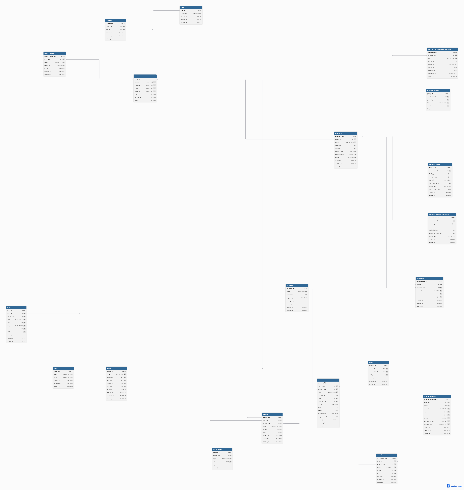

### Architecture — Docker & Kubernetes

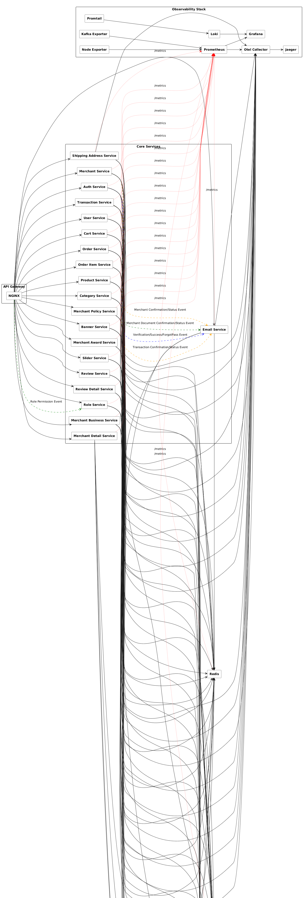
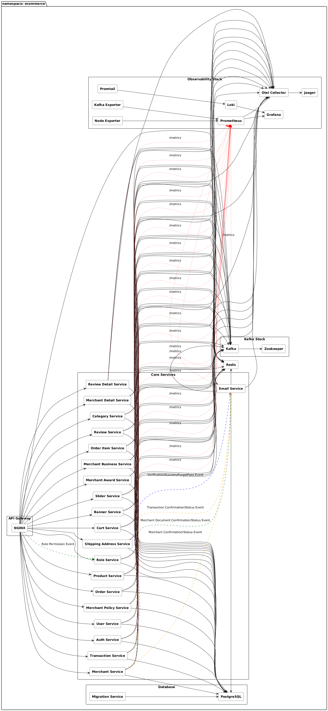

### Observability Dashboards

#### Grafana — Prometheus Metrics

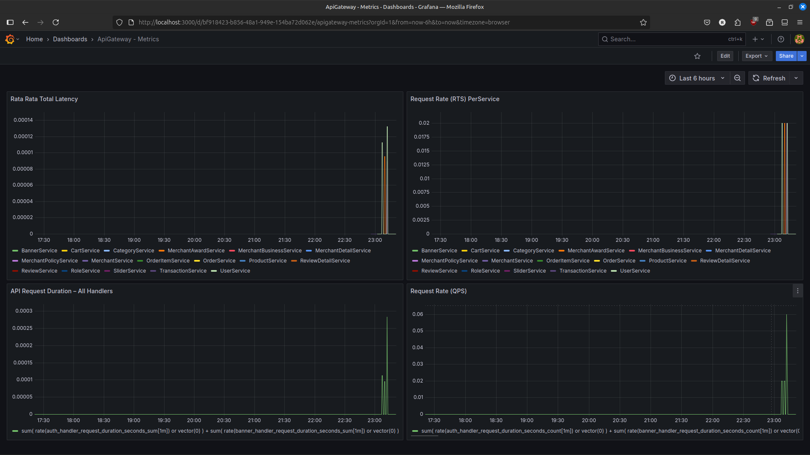

#### Prometheus — Metrics Explorer

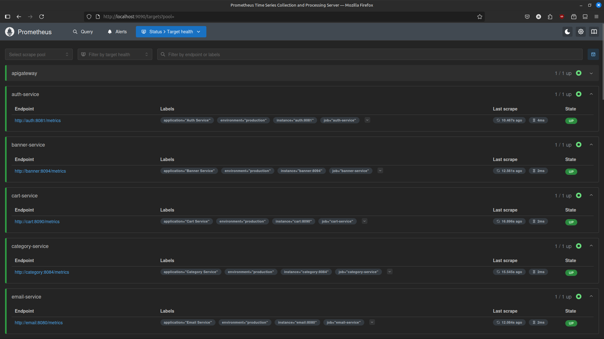

#### Prometheus — Alert Rules

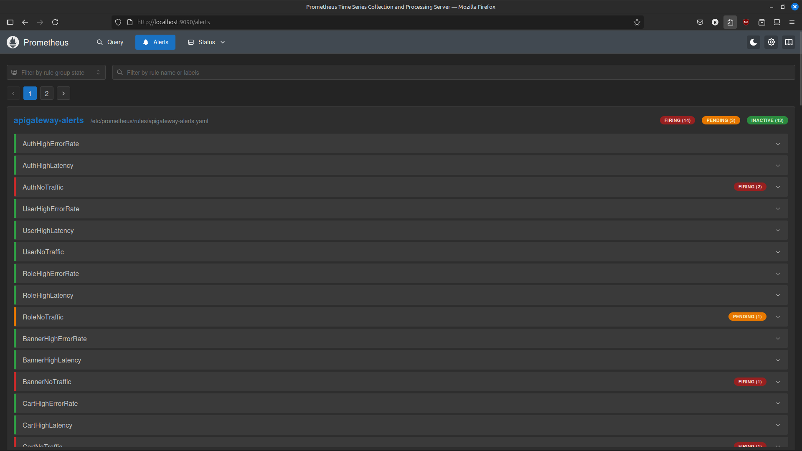

#### Loki — Log Explorer

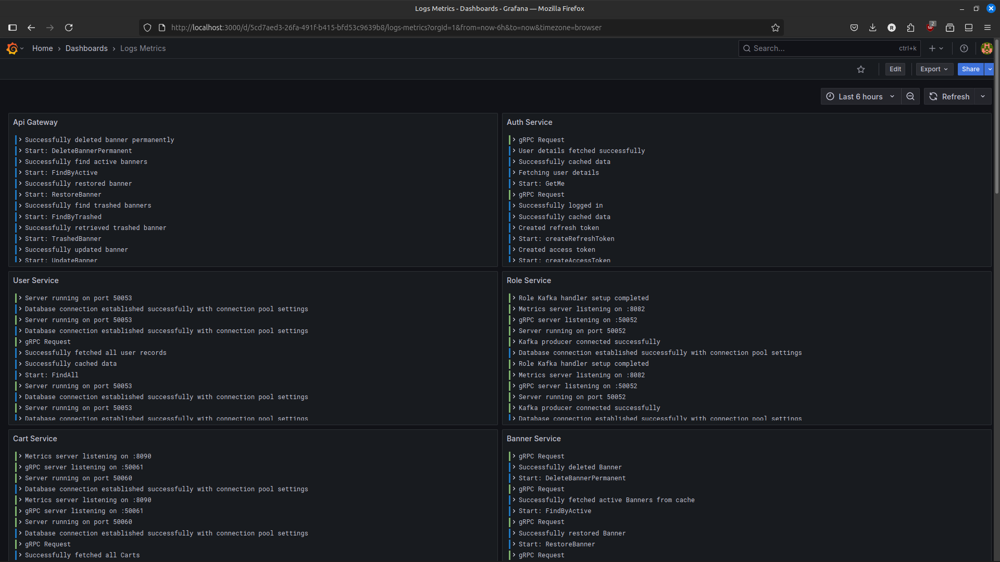

#### Jaeger — Distributed Traces

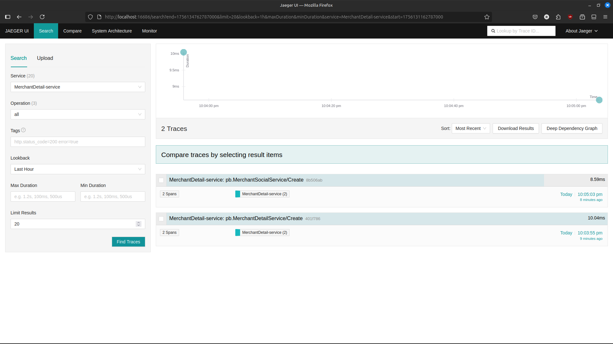

#### Node Exporter — System Metrics

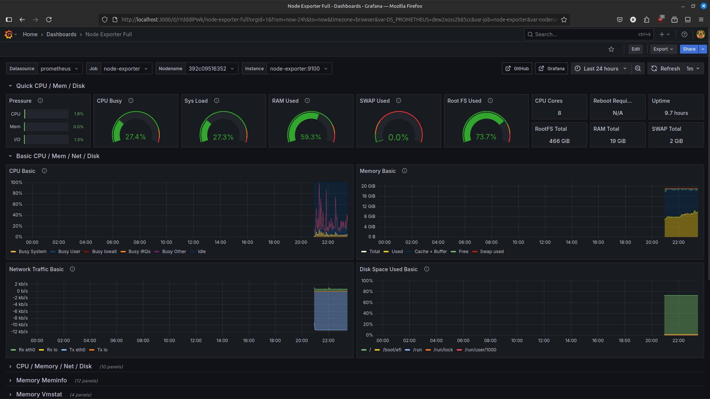

---

## License

This project is open-sourced for educational and development purposes.

---

<p align="center">
  Built with Go, gRPC, PostgreSQL clusters behind PgBouncer, and a passion for clean microservice architecture.
</p>
